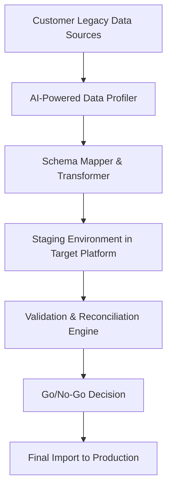
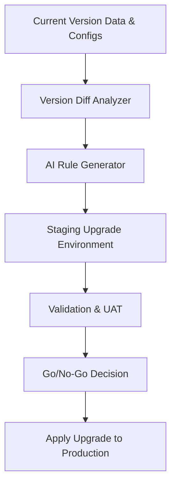

# AI-Assisted Customer Data Migration Plan

## Overview

This document outlines the AI-driven architecture and process to help customers migrate their data from legacy systems into our ready-to-use no-code core banking platform. The goal is to enable smooth, accurate, and low-friction onboarding.

---

## Objectives

- Automate schema discovery and mapping from legacy systems.
- Minimize manual data transformation.
- Use AI to validate, clean, and enrich data.
- Ensure secure, auditable, and reversible data migration.

---

## Migration Architecture Overview

---

## Key AI Components

| Module | Function |
|--------|----------|
| **AI Profiler** | Uses LLMs and ML models to analyze structure, semantics, and patterns in raw customer data. |
| **Schema Mapper** | Suggests mappings between legacy fields and the platform's schema (supports human override). |
| **Data Transformer** | Applies data cleansing, enrichment, normalization (dates, currencies, formats) using AI-driven rules. |
| **Validation Engine** | Auto-generates rules and test cases to verify completeness, consistency, and referential integrity. |
| **Anomaly Detector** | Uses AI to detect unusual patterns, outliers, or missing fields during data preview and test import. |

---

## Migration Phases

### Phase 1: Discovery
- Customer uploads raw exports or connects via secure API.
- AI Profiler analyzes:
  - Schema structure (field names, types, formats)
  - Sample values
  - Hidden relationships (e.g., inferred foreign keys)

### Phase 2: Mapping & Transformation
- AI Schema Mapper suggests field-to-field mapping (CSV → platform entities).
- Transformer auto-generates data cleaning scripts:
  - Date format normalization
  - Currency conversion
  - Code-to-label mapping (e.g., “M” → “Male”)

### Phase 3: Validation & Testing
- Run test imports into staging environment.
- Generate validation report:
  - Record counts
  - Missing data
  - Referential integrity
- User review & confirm

### Phase 4: Final Migration
- AI re-runs updated transformation with logs.
- Final data pushed to production system via secure ETL.
- All actions logged for auditability.

### Phase 5: Post-Migration Reconciliation
- AI compares key data points (balances, status, etc.)
- Reports any drift or mismatch
- Rollback or patching supported via logs

---

## Tools & Technologies

- **LLMs**: OpenAI GPT-4 for schema mapping and transformation scripting
- **ML**: Anomaly detection using isolation forest / clustering
- **ETL Frameworks**: Apache NiFi, custom Python ETL, Airbyte
- **Storage**: Temporary staging DB (PostgreSQL)
- **Security**: Encrypted in-transit and at-rest, signed data dumps, RBAC

---

## Benefits of AI-Driven Approach

- Reduces onboarding effort from weeks to days
- Learns and adapts to diverse customer schemas
- Improves data quality before it enters the system
- Provides explainability and auditability

---

## Human Oversight & Controls

- Manual override for mapping and transformation rules
- Approval workflow for production import
- Auto-generated migration reports for customer sign-off

---

## Sample Mapping Table (Auto-Suggested by AI)

| Legacy Field | Detected Type | Suggested Platform Field | Confidence |
|--------------|----------------|---------------------------|------------|
| `cust_name` | Text           | `customer.full_name`      | 95%        |
| `dob`        | Date (DD/MM/YY)| `customer.birth_date`     | 98%        |
| `bal`        | Decimal        | `account.balance`         | 92%        |

---

## Rollback Strategy

- All transformations are version-controlled
- Staging environment for dry runs
- Rollback script generated before production import
- Immutable audit trail of changes

---

## Next Steps for Customer Onboarding Team

1. Receive sample export from customer
2. Run through AI Profiler + Mapper
3. Review and adjust mapping
4. Validate and run dry import
5. Approve and execute production migration

---

---

## AI-Driven Version Upgrade Support

### Overview

The platform includes support for automatic data and configuration upgrades from Version X to Version Y, allowing customers to benefit from platform enhancements without manual intervention. This upgrade path is powered by AI to minimize downtime and risk.

---

### Key Capabilities

| Feature | Description |
|--------|-------------|
| **Version Diff Analyzer** | Uses AI to compare schema and configuration differences between versions. |
| **Upgrade Rule Engine** | Encodes transformation logic to adapt data structures, field formats, and business rules. |
| **Migration Assistant** | Auto-generates upgrade scripts and previews impact in a staging environment. |
| **Semantic Change Detection** | AI understands intent behind changes (e.g., merging fields, renaming entities). |
| **Validation & Reconciliation** | Tests upgraded environment and validates data consistency, with rollback plan. |

---

### Upgrade Flow

---

### Use Cases

- Schema changes (e.g., split `full_name` into `first_name` + `last_name`)
- Field renaming or deprecation
- Business logic modifications (rule engine updates)
- UI layout reconfiguration
- Platform-specific configuration updates (permissions, workflows)

---

### Rollback and Safety

- Upgrade plan preview with diffs
- Versioned rollback scripts auto-generated
- Logging of all changes and transformations
- Optional dual-run mode for critical environments

---

### Example Upgrade Scenario

| Field in V1 | Field in V2 | AI-Detected Action |
|-------------|-------------|--------------------|
| `dob` (Text) | `birth_date` (Date) | Transform + Rename |
| `account_type` | `product_category` | Semantic Mapping |
| `balance` | Split into `ledger_balance`, `available_balance` | Field Split + Rule Generation |

---

### Benefits

- Safe, repeatable, and explainable upgrade process
- Minimal engineering effort required from customers
- Continuous platform evolution with zero-code upgrades
