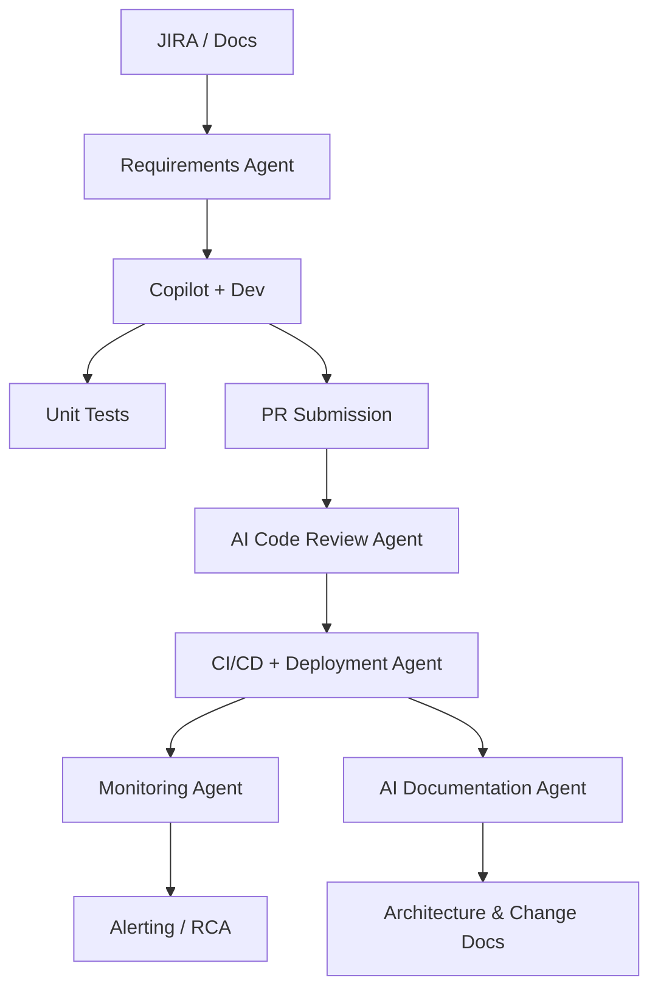

# AI-Driven Software Development & Operations Architecture

This document outlines the architecture and methodology for building, maintaining, and evolving a software system using AI agents, GitHub Copilot, and Model Context Protocol (MCP).

---

## 1. Requirements Ingestion

**Source**: JIRA, Confluence, Markdown files in folders  
**Tooling**: AI Agent + Model Context Protocol

- Agents parse and transform tickets into developer-readable specifications.
- MCP enables agents to reference external files directly (e.g., `context://requirements/REQ-001.md`).

---

## 2. AI-Assisted Development

**Tooling**: GitHub Copilot, VSCode, Contextual File References

- Developers receive contextual suggestions from Copilot referencing requirement docs.
- Unit tests are generated alongside source code using code-aware AI models.

---

## 3. Integration & E2E Testing

**Tooling**: Playwright, Cypress, Postman + AI agents

- AI agents write integration and E2E test suites based on API contracts and workflows.
- Validation agents verify data flow, edge cases, and error handling.

---

## 4. Code Review Automation

**Tooling**: AI Reviewer Agents (e.g., GPT-4 Review Bot)

- Static analysis + semantic understanding of PRs.
- Review suggestions include performance, readability, security, and business logic alignment.

---

## 5. CI/CD and Deployment

**Tooling**: GitHub Actions, ArgoCD, AI-integrated pipelines

- AI agents handle:
  - Validation pre-deploy
  - Canary deployment rollout
  - Rollback planning

---

## 6. Observability & Monitoring

**Tooling**: Prometheus, OpenTelemetry, AI Watchdog Agents

- Agents ingest logs and traces, detect anomalies, and suggest fixes or rollback.
- Root cause analysis (RCA) supported by time-series and log pattern correlation.

---

## 7. Documentation and Change Tracking

**Tooling**: AutoDoc AI, Git Hooks, Vector DBs

- Every code/PR change is automatically documented.
- Changes reflected in design docs, architecture diagrams, and changelogs.

---

## 8. Migration & Upgrade Management

**Tooling**: Migration Agent, Version Diff Tool

- Detects schema or logic changes between versions.
- Generates upgrade plans, transformation scripts, and validation tests.
- Supports rollback, staging diff, and semantic change tracking.

---

## 9. Traceability & Auditing

- All AI agent actions are logged in an **AI Agent Ledger**.
- PRs are tagged with requirement references and agent suggestions.
- All changes trace back to originating JIRA or spec.

---

## 10. Security, Drift Detection, and Governance

- Agents detect infrastructure drift and auto-sync environments.
- AI-enhanced code scanners (e.g., Semgrep, CodeQL) check for vulnerabilities.
- AI governance dashboard audits all AI outputs and human overrides.

---

## Summary

| Phase | AI Role | Tooling |
|-------|---------|---------|
| Requirements | Parse & link context | Model Context Protocol |
| Development | Suggest code + tests | GitHub Copilot |
| Testing | Generate & validate flows | AI Test Agents |
| Review | Semantic + secure review | GPT-4 PR Reviewer |
| Deploy | Validate + rollout | GitHub Actions + ArgoCD |
| Monitor | Detect & auto-correct issues | OpenTelemetry + AI |
| Document | Auto doc + changelog | Vector search + AI doc agent |
| Migrate | Plan upgrade paths | Diff engine + transformation agent |

---

## Diagram: AI-Driven SDLC

